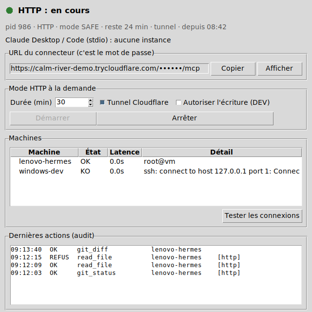

# MCP RemoteDev — SSH + PowerShell

Serveur MCP (stdio, Python) qui permet à Claude Desktop / Claude Code de travailler sur des
projets présents sur des machines distantes, **sans shell libre** : Claude n'a qu'un jeu
d'outils fermés (lire, patcher, git, tests, build, docker, logs), limités à des dossiers
en liste blanche.

```
Claude ──stdio──> RemoteDev (PC local) ──ssh──> Linux  (sh)
                                        ──ssh──> Windows (PowerShell 7 over SSH)  ← recommandé
                                        ──winrm─> Windows (Invoke-Command)
```

> **Lire la section [Modèle de sécurité et limites](#modèle-de-sécurité-et-limites) avant
> de brancher une machine.** Ce MCP réduit la surface d'attaque ; il n'est pas une frontière
> de sécurité. La frontière, c'est l'utilisateur système `claude-dev` et ses droits.

## Installation

```powershell
git clone <ce dépôt> C:\Projet\mcp-remotedev
cd C:\Projet\mcp-remotedev
python -m venv .venv
.\.venv\Scripts\Activate.ps1
pip install -r requirements.txt
copy config\hosts.example.yaml config\hosts.yaml   # ou : ajouter les machines dans l'interface
```

Prérequis sur le PC qui exécute le MCP : Python ≥ 3.10 et le client OpenSSH (`ssh`). Pour
les backends `winrm` et `local` sous Windows, `pwsh` (PowerShell 7) est utilisé s'il est
installé, sinon le Windows PowerShell 5.1 intégré. Paramiko n'est pas utilisé : on passe par
le client OpenSSH, qui gère `~/.ssh/config`, `known_hosts` et `ssh-agent`.

### Lancer et surveiller : `remotedev.cmd` et la mini-interface



Double-cliquer sur `remotedev.cmd` ouvre la fenêtre (le venv est créé automatiquement la
première fois). Elle affiche :
- l'état du mode HTTP : arrêté, démarrage, en cours ou échec (avec les dernières lignes de
  `logs/http.log`), le mode, le temps restant ;
- l'URL du connecteur, masquée par défaut, avec les boutons Afficher et Copier ;
- les instances stdio lancées par Claude Desktop / Code ;
- les boutons Démarrer (durée, tunnel, écriture DEV avec confirmation) et Arrêter ;
- un test de connexion à chaque machine, avec la latence ;
- les dernières actions du journal d'audit (OK / REFUS / ERREUR, `[http]` pour les appels
  distants).

#### Ajouter une machine depuis l'interface

Dans la section Machines, les boutons **Ajouter… / Modifier… / Supprimer** remplissent
`config/hosts.yaml` à ta place. Le formulaire propose les types de connexion suivants :

| Type | Ce que ça fait |
|---|---|
| SSH → Linux (shell) | `ssh` + `sh` sur la cible |
| SSH → Windows (PowerShell 7) | `ssh` + `pwsh` sur la cible (recommandé pour Windows) |
| SSH → Windows (Windows PowerShell 5.1) | `ssh` + `powershell.exe` (`ps_exe: powershell`) |
| PowerShell Remoting (WinRM) → Windows | `Invoke-Command -ComputerName` depuis ce PC |
| Ce PC (local) | exécution directe, surtout pour tester |

Authentification possible : **clé SSH** (ou compte Windows actuel pour WinRM), ou
**identifiant + mot de passe** (`auth: password`). Le mot de passe n'est jamais écrit dans
`hosts.yaml` : il est chiffré avec DPAPI (lié à ton compte Windows sur ce PC) dans
`config/credentials.dat`, qui est ignoré par git. En SSH, il est transmis à `ssh` par
`SSH_ASKPASS` (`remotedev/askpass.py`), jamais sur la ligne de commande. askpass ne répond
qu'aux invites de mot de passe. En WinRM, il n'est déchiffré que dans le processus
PowerShell qui crée le `PSCredential`. Le mot de passe n'est disponible que sous Windows ;
une clé SSH reste préférable.

**Tester la connexion** vérifie l'accès avant d'enregistrer. L'empreinte d'un serveur SSH
inconnu n'est jamais acceptée automatiquement : lance une fois `ssh login@hôte` dans un
terminal. Après une modification, redémarre les serveurs déjà lancés.

L'interface n'ouvre aucun port. Elle lit `logs/run/*.json`, que chaque instance écrit
(ce dossier contient l'URL secrète et n'est jamais commité). Fermer la fenêtre n'arrête pas
le serveur, qui garde son arrêt automatique.

En ligne de commande :

```powershell
remotedev                      # mini-interface
remotedev http --minutes 20    # mode HTTP dans la console
remotedev status               # instances en cours (+ URL)
remotedev stop                 # arrête l'instance HTTP proprement (cloudflared compris)
remotedev check                # teste la connexion à chaque machine
```

Sous Linux/macOS : `./remotedev.sh` avec les mêmes commandes, plus `tui`. Sans écran,
l'interface est en mode texte (voir la section sur le mini PC).

### Claude Code

```powershell
claude mcp add remotedev -- C:\Projet\mcp-remotedev\.venv\Scripts\python.exe C:\Projet\mcp-remotedev\server.py
```

### Claude Desktop (`claude_desktop_config.json`)

```json
{
  "mcpServers": {
    "remotedev": {
      "command": "C:\\Projet\\mcp-remotedev\\.venv\\Scripts\\python.exe",
      "args": ["C:\\Projet\\mcp-remotedev\\server.py"],
      "env": { "REMOTEDEV_MODE": "dev" }
    }
  }
}
```

### Appli ChatGPT / claude.ai (mode HTTP à la demande)

Ces applis n'acceptent que des serveurs MCP distants en HTTPS. RemoteDev peut s'exposer
**temporairement** via un Cloudflare Quick Tunnel, sans compte ni port ouvert sur la box :

```powershell
winget install Cloudflare.cloudflared
.\.venv\Scripts\python.exe server.py --http               # 60 min, lecture seule
.\.venv\Scripts\python.exe server.py --http --minutes 20 --allow-dev
```

La console affiche une URL du type
`https://xxx.trycloudflare.com/<secret>/mcp`. Dans ChatGPT : Paramètres → Applications
(mode développeur) → Créer. Colle l'URL et choisis « aucune authentification ».

- **L'URL est le mot de passe.** Elle contient un secret de 256 bits, régénéré à chaque
  lancement ; tout autre chemin répond 404. Quiconque a l'URL complète a accès aux outils
  tant que le serveur tourne. Relancer le serveur révoque l'ancienne URL.
- Le mode SAFE (lecture seule) est forcé, sauf `--allow-dev`. Avec `--allow-dev`, Claude ou
  ChatGPT peuvent écrire du code et l'exécuter sur tes machines depuis Internet : garde des
  sessions courtes.
- L'arrêt est automatique après `--minutes`. Le serveur n'écoute que sur 127.0.0.1.
- Les réponses sont en JSON, sans SSE : les Quick Tunnels ne transmettent pas les flux SSE.
- À chaque lancement, l'adresse change : il faut modifier l'URL du connecteur dans ChatGPT.
- Les Quick Tunnels sont un service de test chez Cloudflare, sans garantie. Pour un usage
  permanent, il faut un tunnel nommé et une vraie authentification OAuth, qui n'est pas
  implémentée ici.
- Le journal d'audit marque ces appels avec `"transport": "http"`.

`REMOTEDEV_MODE` (`safe` | `dev`) surcharge `policies.yaml`. `REMOTEDEV_CONFIG_DIR` permet
d'utiliser un autre dossier de configuration.

## Installer RemoteDev sur un mini PC Linux dédié

Le mini PC devient le point central : il détient les clés SSH vers toutes les machines et
c'est lui qu'on expose (à la demande) à ChatGPT. Testé sous Linux (Debian/Ubuntu) ; ARM
(Raspberry Pi) : même procédure, non testée.

```bash
sudo apt install python3-venv git openssh-client        # + python3-tk seulement si écran
sudo adduser --disabled-password remotedev               # compte dédié, sans sudo
sudo -iu remotedev
git clone <ce dépôt> ~/mcp-remotedev && cd ~/mcp-remotedev
cp config/hosts.example.yaml config/hosts.yaml           # clés : key: ~/.ssh/claude_dev
ssh-keygen -t ed25519 -f ~/.ssh/claude_dev -N ''          # puis copier la .pub sur chaque cible
./remotedev.sh check                                      # installe le venv, teste les machines
```

cloudflared, pour le mode HTTP : télécharger le binaire `cloudflared-linux-amd64` ou
`cloudflared-linux-arm64` depuis les releases GitHub de Cloudflare, puis le placer dans
`~/.local/bin/cloudflared` (et `chmod +x`).

**Tableau de bord sans écran** : `ssh remotedev@mini-pc` puis `./remotedev.sh`. Sans
affichage graphique, l'interface passe automatiquement en mode texte, utilisable depuis une
appli SSH sur téléphone :

```
RemoteDev — 09:14:02
HTTP  : ● en cours · pid 954 · HTTP · mode SAFE · reste 24 min · tunnel
URL   : https://calm-river.trycloudflare.com/••••••/mcp
stdio : aucune instance
Prochain démarrage : 30 min · tunnel oui · écriture DEV non
[s] démarrer  [x] arrêter  [+/-] durée  [d] écriture DEV  [t] tunnel  [u] URL  [c] tester  [q] quitter
```

La touche `u` affiche l'URL complète, à sélectionner pour la copier : pas de presse-papiers
à travers SSH. Pour démarrer d'une seule commande : `deploy/remotedev-http.service` (unité
systemd utilisateur, jamais lancée au démarrage).

**Claude Desktop / Claude Code sur ton PC, MCP sur le mini PC** : le transport stdio passe
tel quel à travers SSH, sans aucun port ni tunnel :

```json
{
  "mcpServers": {
    "remotedev": {
      "command": "ssh",
      "args": ["-T", "-o", "BatchMode=yes", "remotedev@mini-pc", "~/mcp-remotedev/remotedev.sh", "stdio"]
    }
  }
}
```

`remotedev.sh` n'écrit rien sur stdout, qui est réservé au protocole MCP.

Points spécifiques à Linux :
- **Cibles Windows : backend `ssh` obligatoire.** Depuis Linux, `pwsh` ne sait pas faire de
  WinRM sans module supplémentaire ; le serveur l'affiche au démarrage.
- `key: ~/.ssh/claude_dev` est résolu sur la machine qui exécute le MCP.
- Ce mini PC concentre les clés de toutes tes machines : chiffrement du disque, aucun
  autre service exposé, pare-feu entrant fermé (le tunnel est sortant), compte
  `remotedev` sans sudo, et une clé SSH distincte de ta clé personnelle.

## Préparer une machine Linux

```bash
sudo adduser --disabled-password claude-dev      # pas de sudo, pas de mot de passe
sudo -u claude-dev mkdir -p /home/claude-dev/projects /home/claude-dev/.ssh
# coller la clé publique (claude_dev.pub) :
sudo -u claude-dev tee -a /home/claude-dev/.ssh/authorized_keys
sudo chmod 700 /home/claude-dev/.ssh && sudo chmod 600 /home/claude-dev/.ssh/authorized_keys
```

Côté PC :

```powershell
ssh-keygen -t ed25519 -f "$env:USERPROFILE\.ssh\claude_dev"
ssh -i "$env:USERPROFILE\.ssh\claude_dev" claude-dev@192.168.1.20   # une fois : accepter la clé d'hôte
```

Le MCP utilise `BatchMode=yes` : aucune invite n'est possible. Il faut donc une clé **sans
passphrase** ou chargée dans `ssh-agent`, et une clé d'hôte déjà présente dans
`known_hosts`. Le MCP n'active jamais `StrictHostKeyChecking=no`.

Options utiles :
- `journalctl` pour `service_logs` : `sudo usermod -aG systemd-journal claude-dev`.
- Services redémarrables sans sudo : unités `systemctl --user` de claude-dev
  (`restart_mode: user`, et `loginctl enable-linger claude-dev`). Si vous tenez à un service
  système : `restart_mode: sudo` et une règle sudoers **nominative**, par exemple
  `claude-dev ALL=(root) NOPASSWD: /usr/bin/systemctl restart hermes-dev`.
- Node installé via nvm : il n'est pas dans le `PATH` d'une session SSH non interactive.
  Utiliser `path_prepend` dans `hosts.yaml`.
- Git « dubious ownership » : si le dépôt appartient à un autre utilisateur, git refuse de
  s'y exécuter. Le MCP n'ajoute jamais `safe.directory` pour vous.

## Préparer une machine Windows (PowerShell 7 over SSH, recommandé)

```powershell
# En administrateur, sur la cible :
Add-WindowsCapability -Online -Name OpenSSH.Server~~~~0.0.1.0
Set-Service sshd -StartupType Automatic; Start-Service sshd
winget install Microsoft.PowerShell                        # pwsh doit être dans le PATH système
New-LocalUser claude-dev -NoPassword                       # utilisateur STANDARD, jamais admin
icacls C:\Projet\Tervya /grant "claude-dev:(OI)(CI)M"      # droits uniquement sur les projets
# clé publique -> C:\Users\claude-dev\.ssh\authorized_keys (profil créé à la 1re connexion)
```

Le MCP lance `pwsh -EncodedCommand <bootstrap>`, puis envoie le script et les données par
stdin. Le sous-système SSH PowerShell n'est donc pas nécessaire, et le shell par défaut
(cmd ou powershell) ne voit que du base64. Pas de problème de quoting, pas de limite de
8191 caractères.

**Si `claude-dev` est administrateur**, OpenSSH lui donne un jeton élevé (pas d'UAC) et les
clés sont lues dans `C:\ProgramData\ssh\administrators_authorized_keys`. Tout le modèle
s'effondre. Ne le faites pas.

### Backend WinRM (déconseillé)

`backend: winrm` exécute `Invoke-Command -ComputerName` depuis le PowerShell local, avec
l'identité Windows courante, ou avec `user` + mot de passe enregistré (`auth: password`).
Hors domaine Active Directory, il faut en plus HTTPS ou TrustedHosts. L'endpoint par
défaut exécute Windows PowerShell 5.1 : les scripts générés restent compatibles 5.1. Un
endpoint JEA en mode `NoLanguage` n'est pas compatible, car le MCP envoie des scripts.
**Seule la logique de ce backend est testée ; la couche réseau WinRM, elle, ne l'est pas.**

## Configuration

- `config/hosts.yaml` : machines, `allowed_paths`, projets, permissions (`read`, `dev`),
  docker, services redémarrables, sources de logs. Voir `config/hosts.example.yaml`.
- `config/policies.yaml` : mode global, motifs de secrets, chemins système interdits,
  limites de taille, timeouts, chemin du journal d'audit.

Au démarrage, le serveur refuse une configuration dangereuse : `allowed_path` à la racine
(`/`, `C:\`), `allowed_path` situé dans un chemin protégé, projet hors des
`allowed_paths`, journal d'audit non inscriptible.

Permission effective = mode global ∩ permissions de l'hôte. En mode `safe`, les outils DEV
ne sont **pas exposés** à Claude : ils ne sont pas juste refusés.

## Outils

| Niveau | Outils |
|---|---|
| READ | `host_list`, `host_info`, `system_info`, `disk_usage`, `get_processes`, `get_services`, `list_files`, `read_file`, `file_info`, `search_files`, `git_status`, `git_diff`, `git_log`, `git_branch`, `docker_ps`, `docker_images`, `docker_logs`, `docker_compose_status`, `service_status`, `service_logs`, `read_logs` |
| DEV | `write_file`, `patch_file`, `git_pull` (ff-only), `git_checkout`, `run_tests`, `run_build`, `docker_compose_up`, `docker_compose_down`, `docker_restart`, `restart_dev_service` |
| ADMIN | aucun, volontairement |

Non exposés volontairement : commande arbitraire, `git push/commit/reset/clean/rebase`,
`docker run/exec`, `sudo`, `reboot`, installation de paquets système.

- `patch_file` fait un remplacement exact `old_string` → `new_string`, qui doit être unique
  (ou `replace_all`). C'est bien plus fiable qu'un diff unifié généré par un LLM. Les fins
  de ligne CRLF et l'encodage (BOM, UTF-16) sont préservés.
- `run_tests` / `run_build` détectent automatiquement pytest (avec le venv du projet s'il
  existe), npm/pnpm/yarn, cargo, go, dotnet, make et docker compose. On peut aussi fixer
  `projects.<nom>.test` / `.build` dans `hosts.yaml`. `target` permet de relancer un seul
  test.
- Toutes les écritures sont atomiques (fichier temporaire + renommage).
- `.git/` est protégé en écriture : un hook git, c'est de l'exécution de code.

## Modèle de sécurité et limites

Ce que le MCP fait réellement :

1. **Aucune interpolation de texte du modèle dans du code.** Chemins, requêtes et noms sont
   quotés comme données (`sh` / PowerShell). Le contenu des fichiers passe par stdin.
2. **Double contrôle des chemins** : un contrôle lexical local (`..`, `~`, UNC, flux ADS,
   noms courts 8.3, points finaux NTFS), puis une **garde exécutée sur la cible** sur le
   chemin *résolu* (`realpath` ; refus des symlinks et jonctions sous Windows), dans le même
   script que l'opération. Sans cette seconde garde, un simple
   `ln -s /etc/shadow projet/x.txt` contourne tout filtre lexical, comme celui proposé
   dans la spec d'origine.
3. **Secrets** : les fichiers `.env`, les clés, etc. sont refusés en lecture et en écriture
   (`ACCESS DENIED — SECRET FILE`), même via un lien symbolique. Ils sont exclus de
   `search_files` et de `git_diff`. Les sorties passent par un masquage des formats de jetons
   connus (clés privées, `ghp_…`, `AKIA…`, `sk-…`).
4. **Audit** JSONL (`logs/audit.log`) : horodatage, hôte, outil, paramètres, résultat,
   durée. Le contenu écrit n'y figure jamais (seulement sa taille et son empreinte SHA-256).
5. **Timeouts** partout ; sous Linux, un `timeout` côté cible tue aussi le processus
   distant.
6. `docker_compose_up` inspecte `docker compose config` et refuse `privileged`,
   `network_mode/pid/ipc: host`, `cap_add`, `devices`, le socket docker, et les bind mounts
   hors des `allowed_paths`.

Ce qu'il **ne peut pas** faire, et que vous devez savoir :

- **DEV = exécution de code arbitraire.** `write_file` + `run_tests` permet à Claude
  d'exécuter n'importe quel code en tant que `claude-dev` : il suffit d'écrire un test qui
  lance ce qu'il veut. Même chose pour `npm install` (scripts `postinstall`) et
  `run_build`. Le filtre de secrets, la liste noire de commandes et les chemins interdits
  ne s'appliquent **qu'aux outils** : un test écrit par Claude peut lire `.env` et
  l'afficher. Les seules vraies barrières sont les droits Unix/NTFS de `claude-dev`.
- **Groupe `docker` = root.** Si `claude-dev` est dans le groupe docker, un test peut
  lancer `docker run -v /:/host`. La vérification de `docker_compose_up` n'y change rien.
  N'activez docker que sur des machines où cette équivalence est acceptable, ou utilisez
  Docker rootless.
- La liste noire de commandes (`command_filter.py`) ne filtre que les commandes test/build
  écrites dans votre configuration. C'est un filet contre les fautes de frappe, pas une
  protection.
- Les « confirmations » pour actions à risque reposent sur le client MCP : les outils
  portent des annotations (`readOnlyHint`, `destructiveHint`), et Claude Desktop / Claude
  Code demandent l'approbation par outil. Un paramètre `confirm=true` que le modèle
  remplirait lui-même serait du théâtre.
- Hardlinks : `realpath` ne les détecte pas. Sous Linux, laissez
  `fs.protected_hardlinks=1` (le défaut).
- Il reste une fenêtre TOCTOU entre la garde et l'opération dans un même script. Elle
  n'est exploitable que par un processus qui tourne déjà en tant que `claude-dev`, et
  celui-ci a déjà tous les droits de `claude-dev`.
- Windows over SSH : il n'y a pas de `timeout` côté cible. Si la connexion est coupée, un
  processus de test peut survivre.

## Tests

```bash
pip install -r requirements-dev.txt
pytest
```

La suite exécute réellement les scripts générés, avec le backend `local` : `sh`,
PowerShell (si `pwsh` est installé) et WinRM (avec `Invoke-Command` simulé). Elle
vérifie aussi un serveur MCP complet via stdio. Pour valider le transport SSH contre un
`sshd` joignable dont le dossier cible est sur la même machine :

```bash
REMOTEDEV_SSH_TEST="claude-dev@127.0.0.1:2222:/chemin/cle:/home/claude-dev/projects" pytest
```

La mini-interface est testée sous Linux (Xvfb, Python 3.12). Elle n'a pas été testée sous
Windows, et `remotedev.cmd` non plus.

Le mode HTTP est testé en local (secret, 404, mode SAFE, analyse de la sortie de
cloudflared avec un faux binaire). Le passage par un vrai tunnel trycloudflare n'a pas pu
être testé.

Testé avec `mcp` 1.30 et 2.2, Python 3.11, PowerShell 7.4. Non testé : cibles Windows
réelles, WinRM réseau, Windows PowerShell 5.1.

## Structure

```
server.py                      point d'entrée (stdio, ou --http)
remotedev/http_remote.py       mode HTTP à la demande + Cloudflare Quick Tunnel
remotedev/state.py, ui.py      état des instances, mini-interface tkinter
remotedev/tui.py               tableau de bord texte (curses) pour mini PC sans écran
deploy/remotedev-http.service  unité systemd utilisateur (démarrage à la demande)
remotedev/health.py            test de connexion aux machines
remotedev.cmd, remotedev.sh    lanceurs
remotedev/app.py               construction du serveur, filtrage par mode
remotedev/runtime.py           exécution, préambules de scripts, audit, décorateur @tool
remotedev/config.py            modèles pydantic de hosts.yaml / policies.yaml
remotedev/backends/            ssh_backend.py, powershell_backend.py (WinRM), local_backend.py
remotedev/security/            path_filter.py, command_filter.py, validator.py
remotedev/tools/               files, git, tests, docker, services, system
config/                        hosts.example.yaml, policies.yaml
tests/                         tests unitaires, d'outils (sh/pwsh/winrm) et MCP stdio
```
